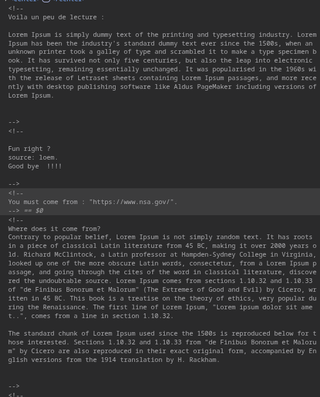
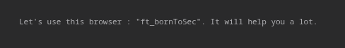

# Objectif 

Manipuler le header d'une requête http en modifiant le referer et le user-agent 

## Code source

Dans le code source on remarque qu'il y a plusieurs sections en commentaires. Deux informations nous interesse: `You must come from : "https://www.nsa.gov/"` et `Let's use this browser : "ft_bornToSec". It will help you a lot.`
Tout laisse à penser qu'il faut changer le referer et le user agent de la requête pour accéder au flag.

## Exploitation

`curl --referer https://www.nsa.gov/ --user-agent "ft_bornToSec" http://10.171.53.2/index.php\?page\=b7e44c7a40c5f80139f0a50f3650fb2bd8d00b0d24667c4c2ca32c88e13b758f | grep flag` 

