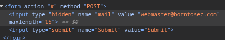

# Objectif

Permettre un recovery de mot de passe en modifiant l'email dans le code source.

# Code source 

Le mail est renseigné en dur directement dans le code source. En cliquant sur le bouton d'envoie du mot de passe oublié, on obtient une erreur.

# Exploitation

En modifiant l'email directement dans l'inspecteur du navigateur par un mail quelconque (mail@mail.com) et en cliquant sur mot de passe oublié, on obtient le flag.

| Étape | Faille | Référence |
|-------|--------|-----------|
| adresse mail modifiable coté client | Weak Password Recovery Mechanism for Forgotten Password | CWE-640 |
