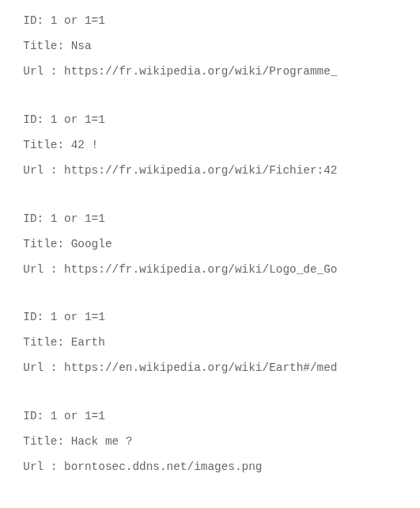
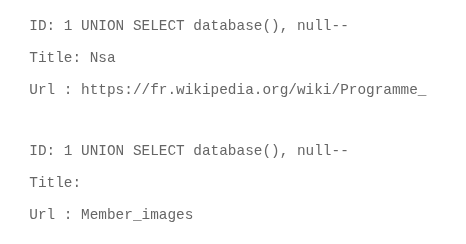
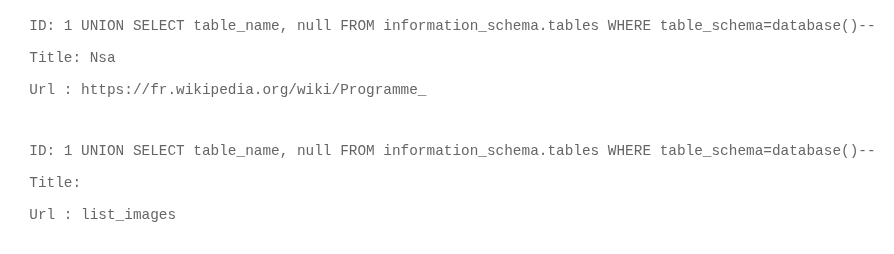
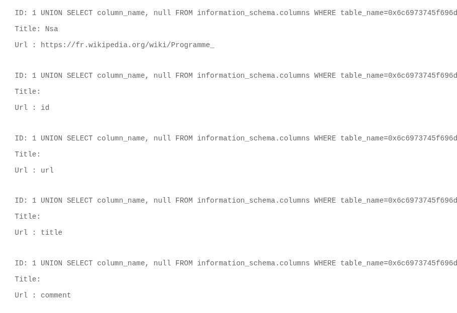
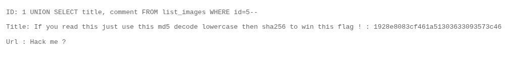

# Objectif
Faire une SQL injection permettant d'obtenir des infos non public.

## Exploitation
Avec le payload `1 or 1=1` on voit que le site est vulnérable aux injections SQL.

Le but maintenant, c'est de découvrir la base de donnée, le nom des tables et leurs colonnes, afin de pouvoir faire des reqêtes SQL personnalisées.

Dans un premier temps on regarde combien de colonne on nous renvoie: `1 ORDER BY 2--`, si rien ne s'affiche alors c'est la limite. Ici 2 est la limite.

Le payload `1 UNION SELECT database(), null--` nous permet d'avoir le nom de la base de données.

Ensuite on cherche une table: `1 UNION SELECT table_name, null FROM information_schema.tables WHERE table_schema=database()--`

On liste les colonnes de cette table, on passe en hexadécimal pour bypasse les guillemets: `1 UNION SELECT column_name, null FROM information_schema.columns WHERE table_name=0x6c6973745f696d61676573--`

On voit nos id, url et title de départ mais on remarque une nouvelle colonne: comment
On va donc tout afficher le commentaire pour la 5ème image qui nous demande de la hacker.
`1 UNION SELECT title, comment FROM list_images WHERE id=5--`

On passe le hash dans crackstation, ce qui nous donne `albatroz`, on l'encode en sha256 comme demandé et obtient le flag.