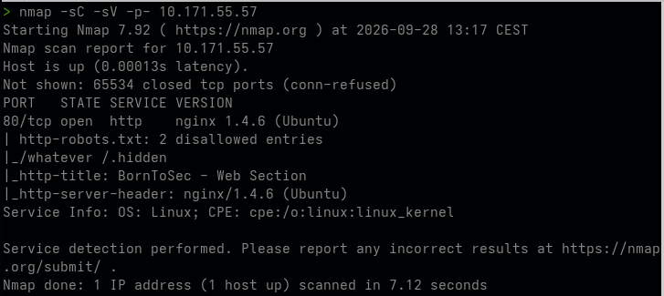
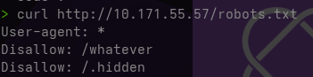
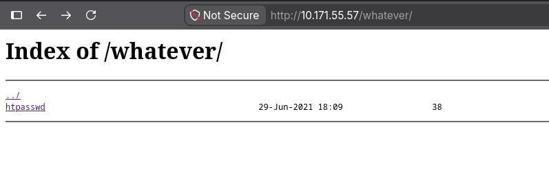
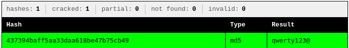

# Objectif

Récupérer des credentials admin en exploitant une mauvaise configuration du serveur web qui expose un fichier sensible, puis casser le hash pour obtenir un accès authentifié.

## Reconnaissance du réseau (Nmap)



Le script http-robots.txt de Nmap a automatiquement récupéré et parsé le fichier robots.txt, révélant deux chemins que l'administrateur voulait "cacher" des moteurs de recherche.

## Vérification manuelle de robots.txt



Faille conceptuelle : robots.txt est un fichier public, pouvant être lu par n'importe qui (pas seulement les crawlers). L'utiliser pour "cacher" des chemins est une erreur classique de security through obscurity.

## Exploration du répertoire ```/whatever```

Dans le navigateur, à l'addresse ```http://10.171.55.57/whatever```. 
Comme le *directory listing* est active sur nginx, on a directement accès au fichier ```htpasswd```



## Téléchargement et lecture du fichier

Il suffit de cliquer pour télécharger le fichier htpasswd (voir => Resources/htpasswd)

On y trouve une seul ligne:
```root:437394baff5aa33daa618be47b75cb49```

Deux choses à faire: identifier et cracker le mot de passe et vérifier l'existence d'un panneau admin comme le suggère le login ```root```.

## Identification et cracking du hash

On a 32 caracterès hexadecimaux. Grâce à https://crackstation.net/, on  découvre qu'il s'agit d'un hash simple type md5.

Résultat:


## Exploitation : accès au panneau admin

```http://10.171.55.57/admin```

Il y a bien un panneau admin auquel on peut s'identifier avec
- Login: ```root```
- Password: ```qwerty123@```

On obtiens le flag!

| Étape | Faille | Référence |
|-------|--------|-----------|
| robots.txt révèle des chemins | Security through obscurity | - |
| htpasswd accessible en HTTP | Sensitive File Exposure | CWE-538 |
| Hash MD5 non salé | Weak Hashing | CWE-916 |
| Mot de passe cassable | Weak Credentials | CWE-521 |

